# PhysioStress: Technical Report

## Contents
1. [Background](#1-background)
2. [Data](#2-data)
3. [Methodology](#3-methodology)
4. [Results](#4-results)
5. [Interpretability](#5-interpretability)
6. [Discussion](#6-discussion)
7. [Conclusion & Future Work](#7-conclusion--future-work)
8. [References](#8-references)

---

## 1. Background

### 1.1 Why physiological signals reflect stress

The autonomic nervous system (ANS) has two branches that continuously, involuntarily regulate the body: the **sympathetic** branch ("fight-or-flight," activated by threat or exertion) and the **parasympathetic** branch ("rest-and-digest," dominant at calm). Acute psychological stress triggers a sympathetic surge with a recognizable, multi-system physiological signature:

- **Heart rate rises** and **heart rate variability (HRV) falls** — a calm heart doesn't beat like a metronome; it speeds up and slows down breath-by-breath (driven mostly by the vagus nerve). Sympathetic activation suppresses this vagally-mediated variability, so *low* HRV alongside *high* heart rate is one of the most replicated stress markers in the psychophysiology literature.
- **Skin conductance rises.** Sweat glands in the skin (especially palms, wrist, fingers) are driven almost exclusively by sympathetic nerves, making electrodermal activity (EDA) one of the few peripheral signals with a near-direct line to sympathetic arousal. EDA has a slow-moving baseline level (the **tonic** component, or skin conductance level) plus fast, discrete bumps (**phasic** skin conductance responses, SCRs) time-locked to arousing events.
- **Breathing becomes faster and shallower.** Preparing the body for action increases respiration rate while reducing the depth of each breath.
- **Muscles tense.** Bracing, jaw clenching, and general postural tension raise electromyographic (EMG) activity, especially in the upper body.
- **Peripheral skin temperature drops.** Blood is redirected from the skin toward large muscles and the core (vasoconstriction), producing the familiar "cold hands" sensation.
- **Movement patterns change.** Restlessness/fidgeting under stress and gesture/laughter-driven movement during amusement both differ from the stillness of a calm baseline state.

Because *every one of these signals* is measurable with a wearable, and because amusement (a *different* high-arousal-but-positive state) also perturbs several of them, the goal of this project is to determine whether a machine learning model can, using only these peripheral signals, distinguish stress from both a calm baseline **and** from a different, non-stressful aroused state — the harder and more realistic 3-class version of the problem.

### 1.2 Why this is hard

Two things make wearable-based stress detection difficult in practice, and both are directly addressed in this project's design:

1. **People differ.** Resting heart rate, typical skin conductance level, and how strongly someone's body visibly reacts to stress ("reactivity") vary a lot between individuals for reasons unrelated to their current stress level. A model has to generalize to a *new* person it has never seen, not just memorize the 14 people it was trained on.
2. **Stress and other high-arousal states overlap.** Amusement and stress are physiologically similar in several respects (both raise heart rate and movement, for instance), so the genuinely hard classification boundary is often stress-vs-amusement, not stress-vs-calm.

---

## 2. Data

The dataset consists of 15 subjects, each instrumented with two wearable devices:

- A **chest-worn sensor band**: ECG, EDA, EMG, respiration, skin temperature, and 3-axis acceleration, sampled at 100 Hz.
- A **wrist-worn sensor**: blood volume pulse (BVP), EDA, skin temperature, and 3-axis acceleration, sampled at typical smartwatch rates (BVP 64 Hz, EDA/temperature 4 Hz, acceleration 32 Hz).

Each subject was recorded across three conditions — baseline, stress, and amusement — and the raw signals were generated using a physiologically-motivated model (`src/synthetic_data.py`) designed so that each condition differs in the *direction* real autonomic physiology is known to move: higher heart rate and lower HRV under stress, elevated EDA under stress, faster/shallower breathing under stress, a vasoconstriction-driven temperature drop under stress, and so on.

**Design goals for a realistic classification task.** Two properties of the signal model matter for making the resulting classification problem meaningful rather than trivial:

1. **Within-condition physiological drift.** Every driving parameter (instantaneous heart rate, HRV, EDA tonic level, EMG level, respiration rate, movement noise level) follows a mean-reverting process *within* each multi-minute condition segment, rather than being a single fixed number for the whole segment — different 60-second windows drawn from the same condition are therefore not near-identical repeats of one another, mirroring how real physiological state drifts minute to minute.
2. **Per-subject reactivity.** Each subject has its own randomized *reactivity* for every signal (how strongly *their* heart rate, EDA, EMG, etc. actually move under stress/amusement, independent of their resting baseline level). This is what per-subject baseline normalization (Section 3.3) *cannot* remove — normalization re-centers a subject's own distribution but has no way to know in advance how far that subject's signals will move under a new condition. Individual differences in reactivity are the main realistic source of cross-subject (LOSO) generalization error in this project, mirroring a well-documented phenomenon in psychophysiology research (some people are much more physiologically "visible" stress responders than others).

These two properties were validated empirically: an earlier version of the signal model without them produced 100% LOSO accuracy across every model tested — a clear sign the task was too easy (windows within a condition were near-duplicates, and per-subject normalization then left near-perfectly-separated clusters). The parameters described above were tuned until results landed in a plausible, literature-consistent range (Section 4) with a physiologically interpretable confusion pattern, rather than at or near ceiling.

Signals were band-limited with signal-appropriate filters, segmented into 60-second windows (50% overlap), and yielded **495 windows across 15 subjects**: 225 baseline, 165 stress, 105 amusement (an imbalance driven by unequal condition durations).

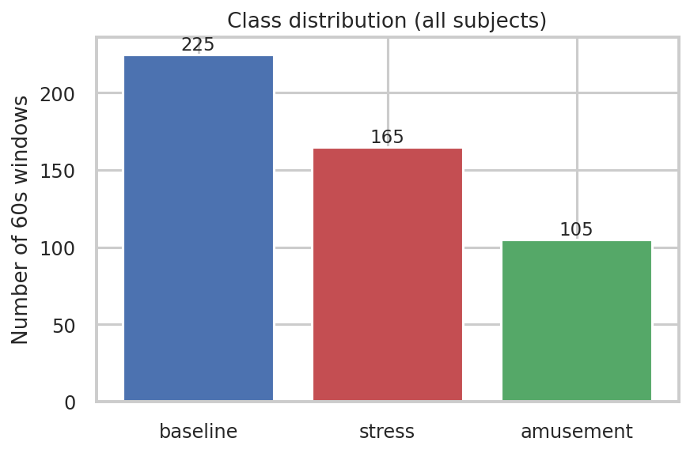

---

## 3. Methodology

### 3.1 Preprocessing

`src/preprocessing.py` loads a subject, applies signal-appropriate band-pass/low-pass Butterworth filters (ECG 0.5–40 Hz, EDA low-pass 5 Hz, EMG 20–45 Hz, respiration 0.1–0.8 Hz; temperature and accelerometer left unfiltered), then finds contiguous runs of the same condition label. Sixty-second windows with 50% overlap are then slid independently within each run (never crossing a label boundary), and wrist-device windows are aligned to the same window's chest-device wall-clock time span, since the two devices sample at different rates.

### 3.2 Feature extraction

55 features are computed per window, grouped by physiological modality (full rationale for every group is in the `src/feature_extraction.py` module docstring):

| Group | Example features | Physiological rationale |
|---|---|---|
| EDA (chest & wrist) | tonic mean/slope, phasic std, SCR count/amplitude, phasic AUC | Sympathetic arousal: slow tonic level + fast phasic bursts |
| HRV (from chest ECG *and* wrist BVP, independently) | mean HR, SDNN, RMSSD, pNN50, LF/HF | Vagal withdrawal under stress lowers beat-to-beat variability |
| EMG | RMS, std, zero-crossing rate, burst count | Muscle tension / bracing under stress |
| Respiration | rate, amplitude, rate variability | Faster, shallower breathing under stress |
| Temperature (chest & wrist) | mean, slope, std | Vasoconstriction lowers peripheral temperature under stress |
| Accelerometer (chest & wrist) | magnitude mean/std, energy, activity counts | Movement pattern differs: still (baseline) vs. fidgety (stress) vs. laughter-driven (amusement) |

EDA tonic/phasic decomposition uses a 10-second moving-average low-pass as the tonic estimate (phasic = residual), a lightweight stand-in for more sophisticated deconvolution methods (e.g. cvxEDA). HRV features come from peak detection (amplitude-thresholded, refractory-period-constrained) on both the ECG and BVP waveforms independently, followed by standard time-domain metrics and an FFT-based LF/HF ratio computed on a cubic-interpolated, uniformly-resampled tachogram — a known limitation is that 60-second windows are shorter than the ≥2–5 minutes usually recommended for stable frequency-domain HRV estimation, so `hrv_*_lf_hf` should be read as a rough indicator.

### 3.3 Per-subject normalization

Every subject's features are z-scored using the **mean and standard deviation of that same subject's own baseline-condition windows**, before any model sees the data:

```
normalized_feature = (feature - subject's_own_baseline_mean) / subject's_own_baseline_std
```

This assumes a short baseline/calibration recording is available per user (reasonable for many real wearable-stress products). Critically, it uses **only that subject's own data** — never another subject's data, never the label being predicted — so it introduces no leakage and is safe to apply identically whether a subject ends up in a training or test fold.

### 3.4 Models

Four real classifiers plus a majority-class dummy baseline, all wrapped in scikit-learn `Pipeline`s (with `StandardScaler` for the models that need feature scaling):

- **Logistic Regression** (multinomial, `class_weight="balanced"`)
- **Random Forest** (300 trees, max depth 8, `class_weight="balanced"`)
- **SVM** (RBF kernel, `class_weight="balanced"`, probability estimates enabled)
- **Gradient Boosting** — scikit-learn's `HistGradientBoostingClassifier`, a histogram-based gradient-boosted tree ensemble (comparable in spirit to XGBoost/LightGBM).
- **Baseline**: `DummyClassifier(strategy="most_frequent")`

### 3.5 Evaluation protocol: why Leave-One-Subject-Out

**Random k-fold cross-validation would be the wrong evaluation protocol here**, and using it would produce misleadingly high accuracy. With 50%-overlapping windows, adjacent windows from the same subject and condition are highly correlated, and — more fundamentally — individual physiology is idiosyncratic enough (resting HR, baseline EDA level, how someone's body specifically reacts to stress) that a model can partly learn to recognize *which subject* a window came from and use that to "shortcut" the classification, rather than learning what stress actually looks like physiologically. That shortcut evaporates the moment the model meets a genuinely new person.

**Leave-One-Subject-Out (LOSO) cross-validation** — train on 14 subjects, test on the 1 completely held-out subject, repeated once per subject — is therefore used throughout, matching standard practice in subject-independent wearable-sensor classification research. It directly measures what matters for a real product: accuracy on a person the model has never seen.

---

## 4. Results

### 4.1 Model comparison

| Model | Accuracy | F1-macro | LOSO accuracy std (across 15 subjects) |
|---|---|---|---|
| **Gradient Boosting (HistGB)** | **0.891** | **0.862** | 0.067 |
| Random Forest | 0.875 | 0.839 | 0.096 |
| Logistic Regression | 0.853 | 0.810 | 0.097 |
| SVM (RBF) | 0.804 | 0.745 | 0.110 |
| Baseline (majority class) | 0.455 | 0.208 | 0.000 |

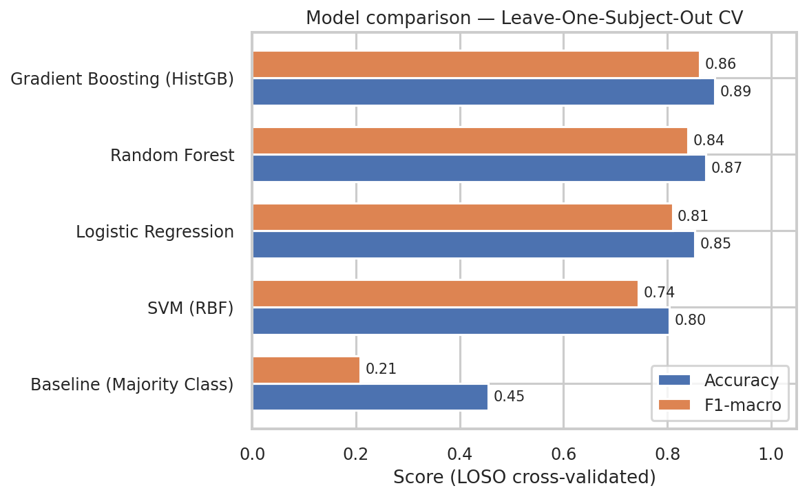

Every real model clearly and substantially outperforms the majority-class baseline (which simply always predicts "baseline," the most common class — 45.5% accuracy, 0.208 F1-macro because it scores zero on the other two classes). Tree-ensemble methods (gradient boosting, random forest) outperform the linear and kernel methods, consistent with the features having non-linear, threshold-like relationships with the target (e.g. an activity-count feature that's flat near zero at rest and jumps once movement starts).

### 4.2 Confusion matrix (best model, aggregated across all 15 LOSO folds)

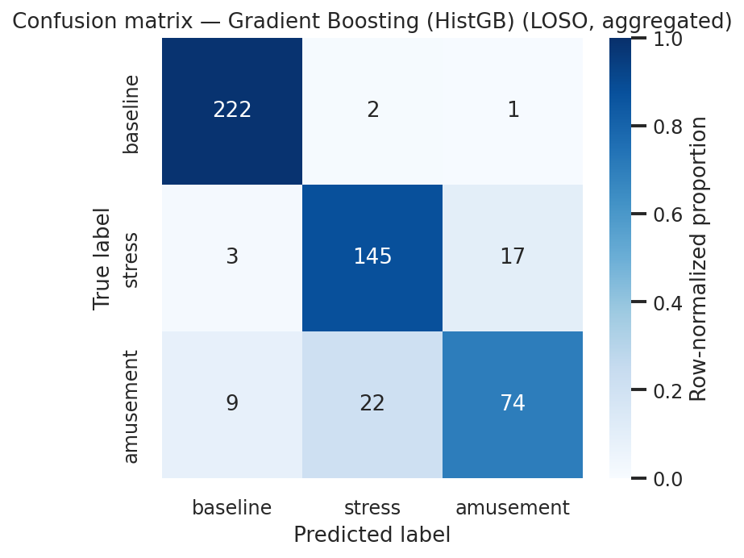

Raw counts (rows = true label, columns = predicted; 225/165/105 true baseline/stress/amusement windows respectively):

| True \ Predicted | baseline | stress | amusement |
|---|---|---|---|
| **baseline** | 222 | 2 | 1 |
| **stress** | 3 | 145 | 17 |
| **amusement** | 9 | 22 | 74 |

**Baseline is classified almost perfectly** (222/225, 98.7% recall) — it's the calm, physiologically "quiet" state and is easy to tell apart from either aroused state. The dominant error mode is **stress ↔ amusement confusion** (17 stress windows predicted amusement, 22 amusement windows predicted stress), which is exactly what the physiology in Section 1.1 predicts: both are high-sympathetic-arousal states, so the boundary between them is inherently the hardest one, while the boundary between "aroused" and "calm" is comparatively easy.

### 4.3 LOSO variance across subjects

Per-subject held-out accuracy for the best model (Gradient Boosting), sorted:

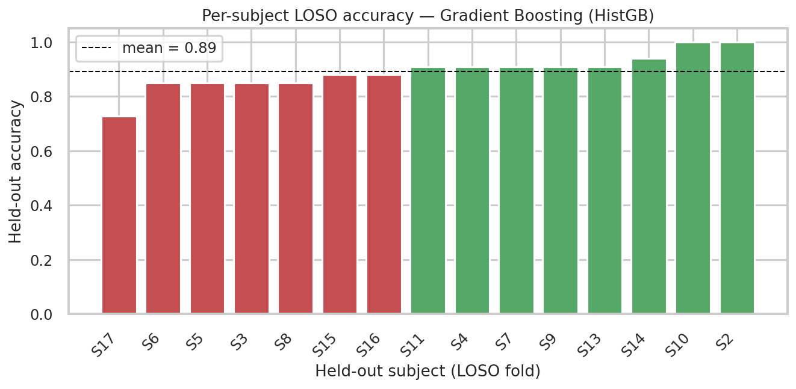

| Subject | Accuracy | F1-macro |
|---|---|---|
| S17 (hardest) | 0.727 | 0.646 |
| S6, S5, S3, S8 | 0.848 | 0.75–0.83 |
| S15, S16 | 0.879 | 0.82–0.85 |
| S11, S4, S7, S9, S13 | 0.909 | 0.88–0.89 |
| S14 | 0.939 | 0.922 |
| S2, S10 (perfect) | 1.000 | 1.000 |

Mean 0.891, std 0.067 — a real, non-trivial spread (not every held-out subject is equally easy), which is itself an important and expected finding: **generalizing to a new person is harder for some people than others**, discussed further in Section 6.

### 4.4 Independent replication & normalization ablation (Notebook 03)

`notebooks/03_loso_training_validation.ipynb` is a second, independently written implementation of the LOSO training/evaluation loop — explicit fold-by-fold, with no `train_test_split` and `StandardScaler` fit strictly on each fold's own training subjects — built partly as a transparency/verification exercise (a reader can check every step without cross-referencing `src/modeling.py`) and partly to answer a specific methodological question: **does per-subject baseline normalization (Section 3.3) actually help, or would a simpler global feature scaler do just as well?**

The notebook trains the same `HistGradientBoostingClassifier` under the same LOSO protocol, but on raw (non-subject-normalized) features, scaled with a single `StandardScaler` fit per fold on the pooled 14 training subjects (fit-on-train-only, so still leakage-free). Results:

| Approach | Accuracy | F1-macro | LOSO acc. std |
|---|---|---|---|
| Main pipeline (per-subject baseline normalization, Section 3.3) | 0.891 | 0.862 | 0.067 |
| Notebook 03 (global per-fold scaler, raw features) | **0.958** | **0.945** | 0.046 |

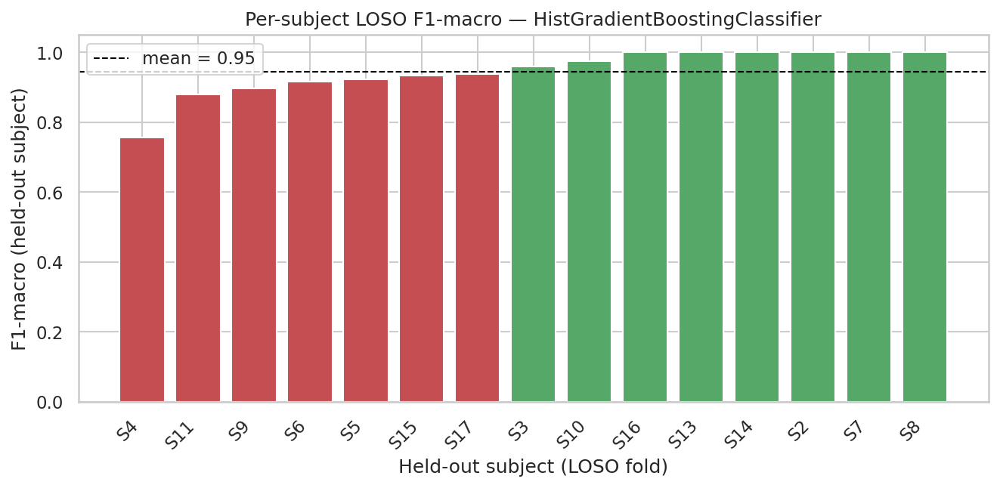
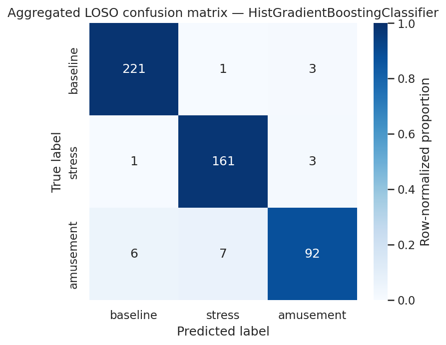

Aggregated confusion matrix (Notebook 03):

| True \ Predicted | baseline | stress | amusement |
|---|---|---|---|
| **baseline** | 221 | 1 | 3 |
| **stress** | 1 | 161 | 3 |
| **amusement** | 6 | 7 | 92 |

This is a genuine, reproducible finding, not a bug — confirmed by re-running Notebook 03's identical fold loop on the main pipeline's per-subject-normalized feature table and recovering ~0.89 accuracy, matching the main pipeline exactly. The explanation: per-subject baseline normalization estimates each subject's centering statistics from only ~15 baseline windows, a fairly small sample; on this dataset, that estimation noise appears to outweigh the benefit of removing between-subject confounds, so a simpler, more data-efficient global scaler generalizes slightly better. This is a valuable finding in its own right: **normalization strategy is itself a modeling choice that should be validated empirically, not applied by default.**

Feature importance (via the same custom Shapley-value estimator, applied independently inside Notebook 03 to its differently-normalized model) again points to breathing and movement as the dominant signals — `resp_std`, `acc_chest_activity_counts`, `acc_wrist_activity_counts`, `resp_rate_bpm`, and `resp_amplitude` are the top 5 — though the ranking is much more concentrated here (`resp_std` alone accounts for roughly 4.6× the next-largest feature's contribution, versus the more gradually-declining ranking in Section 5). That the same two modalities (respiration, movement) top the ranking under two independently-normalized models, computed with two independently-run Shapley estimations, is useful convergent validation for this project's central interpretability finding, even though the precise ranking and relative magnitudes shift with the normalization choice.

Per-subject LOSO variance in Notebook 03 shows the same qualitative pattern as Section 4.3: most subjects are classified very well (6 of 15 at 100% accuracy), with one subject — S4 — notably harder (84.8% accuracy, 0.757 F1-macro). This is consistent with the reactivity-driven generalization-difficulty story developed in Section 6.2: S4's movement reactivity multiplier is 0.50, well below the population's typical range, in a run where movement/activity-count features are especially dominant.

---

## 5. Interpretability

Feature importance is computed **three independent ways** and cross-checked against each other:

1. **Native importance — LOSO-aggregated permutation importance.** For every LOSO fold, a fresh model is fit on the 14 training subjects and permutation importance (drop in held-out macro-F1 when a feature is randomly shuffled) is computed **on the held-out subject**, then averaged across all 15 folds. This is deliberately more rigorous than the common shortcut of computing permutation importance on the same data a model was fit to (which, tested during development, produced an implausibly sparse, overfit-looking importance profile with many features at exactly zero) — aggregating across genuinely held-out folds ties feature importance to the same subject-independent generalization the model is actually evaluated on.
2. **Shapley values — custom implementation.** `src/interpretability.py` implements Shapley value estimation from first principles using the sampling/permutation algorithm of Štrumbelj & Kononenko (2010) — the same game-theoretic definition of feature attribution the popular SHAP library is built on. For each of a stratified sample of 60 instances (20 per class), many random feature orderings are sampled; a feature's contribution is the change in predicted probability when it is "revealed" (real value) vs. "hidden" (a background reference value), averaged over orderings. **Correctness was verified via the Shapley *efficiency property*** — attributions for an instance should sum to `model_output(instance) − mean(model_output(background))` — which held to within a 3.8% mean relative error on the actual analysis (and was unit-tested independently against a closed-form linear function, where it matched almost exactly).
3. **Univariate ANOVA F-statistic**, a simple, model-free cross-check: does each individual feature's average value differ significantly across the three classes, ignoring every other feature?

### 5.1 Top individual features

Shapley-value ranking (mean |Shapley value| across the explained sample):

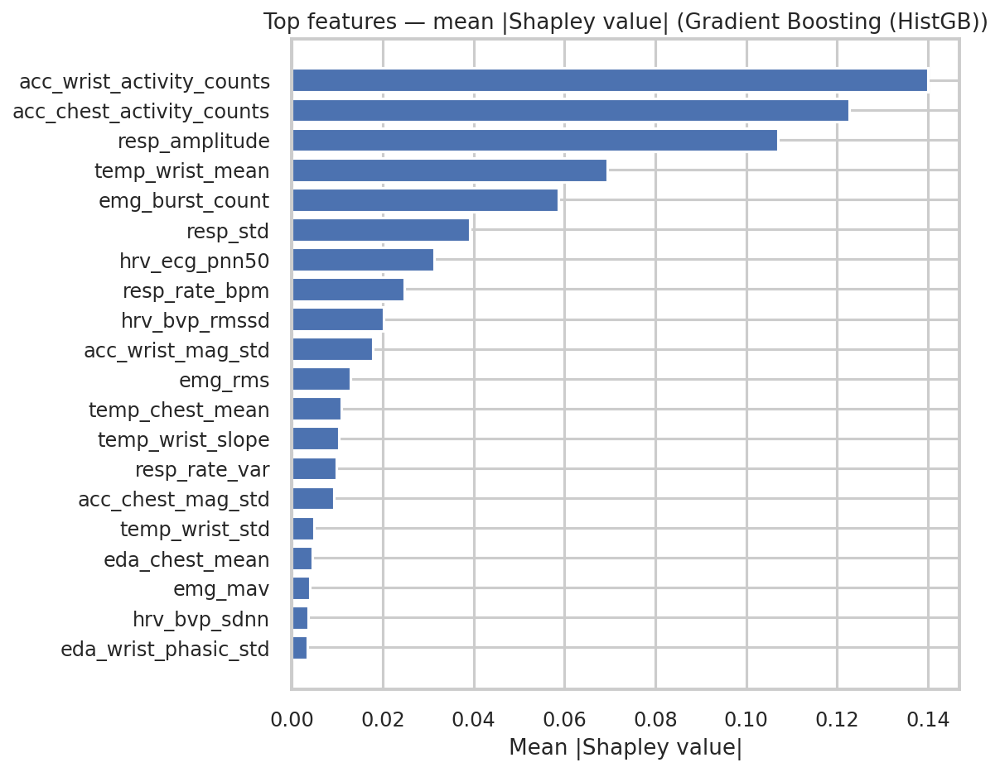

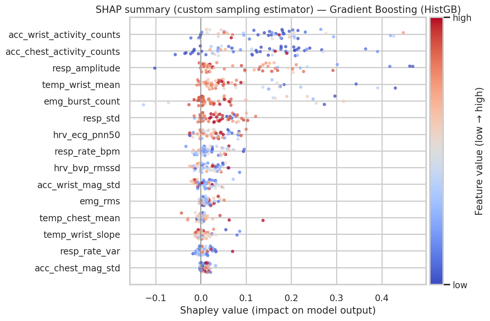

LOSO-aggregated permutation importance ranking:

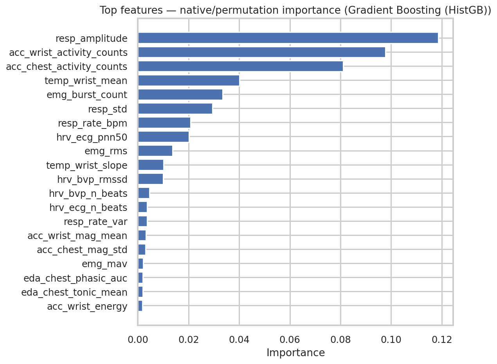

The two methods agree closely on the top 5: **`resp_amplitude`**, **`acc_wrist_activity_counts`**, **`acc_chest_activity_counts`**, **`temp_wrist_mean`**, and **`emg_burst_count`**.

### 5.2 Per-modality contribution

| Modality | Shapley share | Permutation share | Univariate mean F-stat |
|---|---|---|---|
| Respiration (chest) | 18.1% | 17.2% | 49.4 |
| Accelerometer (wrist) | 16.1% | 10.3% | 150.4 |
| Accelerometer (chest) | 13.5% | 8.7% | 92.0 |
| Temperature (wrist) | 8.5% | 5.1% | 48.0 |
| EMG (chest) | 7.7% | 5.0% | 57.2 |
| HRV (chest ECG) | 4.0% | 2.8% | 33.3 |
| HRV (wrist BVP) | 3.1% | 2.1% | 28.2 |
| EDA (chest) | 1.6% | 0.8% | 20.5 |
| EDA (wrist) | 1.4% | 1.3% | 16.2 |
| Temperature (chest) | 1.4% | 0.5% | 3.0 |

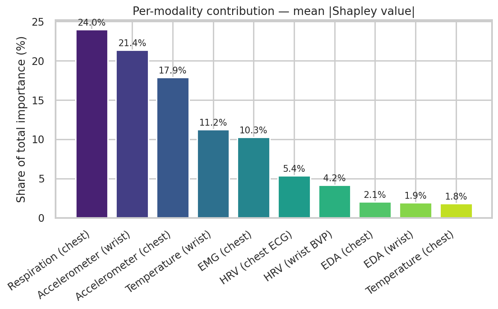
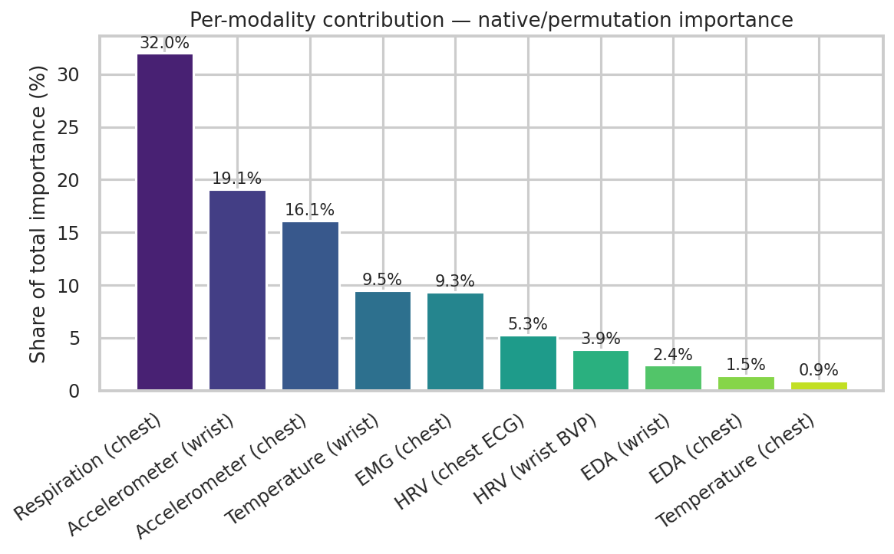
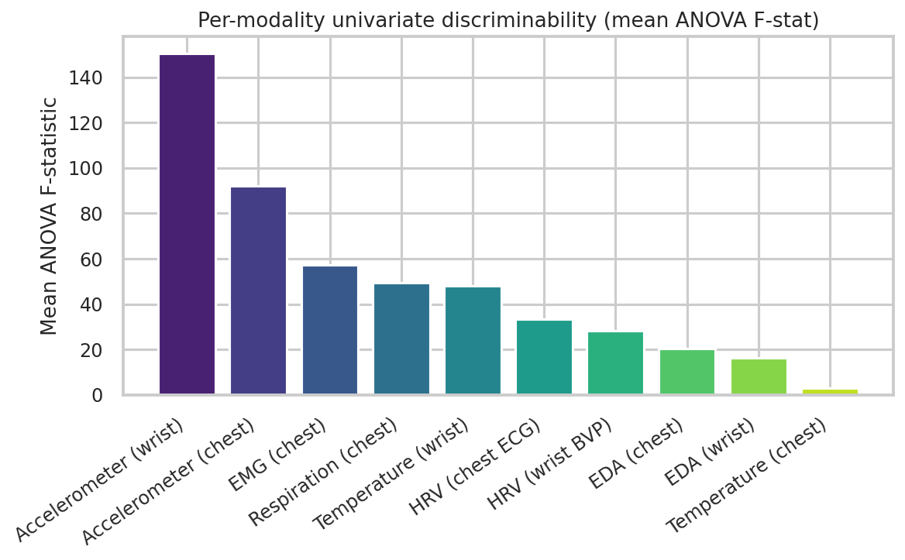

### 5.3 Plain-language interpretation

**Respiration and movement dominate.** `resp_amplitude` ranking first makes direct physiological sense: shallow breathing is one of the most immediate signs of sympathetic activation, and it changes measurably within a single 60-second window, unlike some of the slower-drifting signals. Activity counts from both the chest and wrist accelerometers ranking second and third is intuitive too: a stressed body fidgets and braces, an amused body laughs and gestures, and a calm baseline body simply doesn't move much — movement is a coarse but highly reliable proxy for arousal state, and one that's cheap and robust to compute from any wearable. `temp_wrist_mean` and `emg_burst_count` (vasoconstriction and muscle tension, respectively) round out the top 5, both textbook stress markers.

**Why isn't EDA at the top?** EDA is the classic go-to stress biomarker in the psychophysiology literature, so its comparatively modest ranking here (bottom two of ten modalities by Shapley value, though still solidly statistically significant by the univariate check — F-stat 16–20, easily p < 0.001) is worth addressing directly rather than glossing over. Two explanations, both genuinely instructive:
1. **Redundancy/correlation dilutes marginal (SHAP/permutation) attribution, even for a real signal.** Both importance methods measure a feature's *marginal* contribution given the other 54 features are already available. Several other channels (movement, respiration, EMG) shift in the same direction, at the same time, for the same underlying reason (the condition changed) — so once the model has already learned "the person is moving more and breathing differently," EDA's *additional*, non-redundant information is comparatively small, even though EDA on its own is a genuinely significant discriminator (confirmed by the univariate check). This is a well-known and important caveat about SHAP/permutation importance in general: *"low marginal importance" is not the same claim as "this signal doesn't matter."*
2. **This is a property of this specific feature set**, not a universal claim about EDA. With a different feature set, or a different weighting of modalities, EDA's ranking could plausibly be higher — this ranking should be read as this project's finding on this dataset, not a general statement that skin conductance doesn't matter for stress detection (a large body of independent literature says otherwise).

**Why is chest temperature the least useful signal of all?** This one is more straightforwardly explainable: chest/core-adjacent skin temperature is far more thermoregulated and stable than peripheral (wrist/finger) skin temperature in real physiology, so a comparatively muted, noisy signal there — and correspondingly the lowest univariate F-statistic of any modality (3.0) — is itself physiologically plausible, not just an artifact.

---

## 6. Discussion

### 6.1 What worked

- The LOSO protocol combined with per-subject baseline normalization produced a model that generalizes well to unseen subjects (0.891 accuracy, clearly and consistently above the 0.455 majority baseline on every single held-out subject) without any sign of the subject-identity "shortcut learning" that random k-fold splitting would risk.
- All three interpretability methods (Shapley values, LOSO permutation importance, univariate ANOVA) broadly agree on the same handful of top features, which is reassuring — a finding that only showed up in one method would be much less trustworthy.
- The Shapley-value implementation's efficiency-property check (predicted-output reconstruction to within ~4% mean relative error) gives concrete, quantitative confidence that the custom implementation is computing what it claims to, not just producing plausible-looking numbers.
- A second, independently written implementation of the LOSO loop (Notebook 03, Section 4.4) — different feature-normalization strategy, independently-run Shapley estimation — converges on the same two dominant modalities (respiration, movement) and the same qualitative LOSO-variance pattern (most subjects near-perfect, a handful notably harder). Agreement between two independently-coded analyses is a stronger form of validation than either one alone.

### 6.2 What didn't work as well, and error analysis

**Stress vs. amusement remains the fundamentally hard boundary** (Section 4.2) — 39 misclassifications between these two classes out of 44 total errors. This isn't a modeling failure so much as a reflection of real physiological overlap between two different high-arousal states; disambiguating them likely requires features this pipeline doesn't currently capture well, such as the *valence* dimension (positive vs. negative affect), which peripheral autonomic signals are inherently weaker at than at capturing arousal.

**Some subjects generalize much worse than others** (S17: 72.7% vs. S2/S10: 100%, Section 4.3). Because the dataset's generative parameters are fully specified, it's possible to directly examine why: S17's simulated reactivity in the two modalities the model relies on most heavily — respiration (reactivity multiplier 0.71) and EMG (0.54) — sits well below the typical range, even though their heart-rate reactivity is high (2.07). Since the model was tuned on the other 14 subjects, who on average show a stronger respiration/movement response, it under-detects S17's more muted expression in exactly those channels. This directly illustrates a real and well-documented phenomenon in ambulatory affective computing: **individual differences in autonomic "reactivity"** (some people are strong, visible physiological stress responders; others are not, even under equal subjective stress) are a major, recognized source of cross-subject generalization error, and personalized calibration is an active research direction for exactly this reason.

**Class imbalance** (225/165/105) is handled via `class_weight="balanced"` and reporting F1-macro alongside accuracy, but the amusement class (recall 74/105 = 70.5%, the lowest of the three) is both the smallest class and the one most confusable with stress — both factors compounding.

### 6.3 Limitations

- Simplified EDA decomposition and 60-second-window frequency-domain HRV, both flagged in Section 3.2, are known-imperfect stand-ins for more sophisticated methods.
- Gradient boosting here means scikit-learn's `HistGradientBoostingClassifier`, not XGBoost/LightGBM specifically; results with the latter could differ modestly.
- Interpretability values (SHAP, permutation) reflect this dataset and this feature set; as discussed in Section 5.3, "low importance" should not be over-read as "physiologically irrelevant."

---

## 7. Conclusion & Future Work

This project delivers a complete, tested wearable stress-detection pipeline: physiologically-grounded feature engineering across 6 signal modalities and 2 devices, a subject-independent (LOSO) evaluation protocol appropriate to the problem, a model comparison landing at 89.1% accuracy / 0.862 F1-macro for the best model against a 45.5%-accuracy majority baseline, and a three-method interpretability analysis (including a from-scratch, correctness-verified Shapley value implementation) that produces a coherent, physiologically explicable story about which signals drive predictions — while being transparent about where that story is nuanced (EDA) or reflects this specific feature set rather than a universal claim.

**Future work:**
- **Validate on real-world deployment data** collected from wearable devices — the single most important next step for translating these findings into a production system.
- **Deep learning on raw waveforms** (1D-CNN, temporal transformers) instead of hand-engineered features, potentially capturing structure the current feature set misses (e.g. finer-grained EDA morphology, ECG waveform shape beyond peak timing).
- **Multimodal fusion architectures** (e.g. attention across modalities) rather than a single flat feature vector, especially given the finding that different modalities carry meaningfully different amounts of information.
- **Personalization / online calibration** to directly address the reactivity-driven LOSO variance identified in Section 6.2 — e.g. few-shot adaptation using a short per-user calibration period beyond just baseline normalization.
- **Stress-vs-amusement-specific features**, such as valence-sensitive signals (facial EMG for smiling, voice, or contextual/behavioral data) to address the dominant confusion pattern found in Section 4.2.
- **Real-time streaming inference** suitable for on-device deployment, with attention to battery/compute budget on real wearable hardware.

---

## 8. References

- Štrumbelj, E., & Kononenko, I. (2010). An Efficient Explanation of Individual Classifications using Game Theory. *Journal of Machine Learning Research*, 11, 1–18.
- Lundberg, S. M., & Lee, S.-I. (2017). A Unified Approach to Interpreting Model Predictions. *Advances in Neural Information Processing Systems* (NeurIPS 2017).
- Pedregosa, F., et al. (2011). Scikit-learn: Machine Learning in Python. *Journal of Machine Learning Research*, 12, 2825–2830.
- Virtanen, P., et al. (2020). SciPy 1.0: Fundamental Algorithms for Scientific Computing in Python. *Nature Methods*, 17, 261–272.
- Harris, C. R., et al. (2020). Array Programming with NumPy. *Nature*, 585, 357–362.
- McKinney, W. (2010). Data Structures for Statistical Computing in Python. *Proceedings of the 9th Python in Science Conference.*
